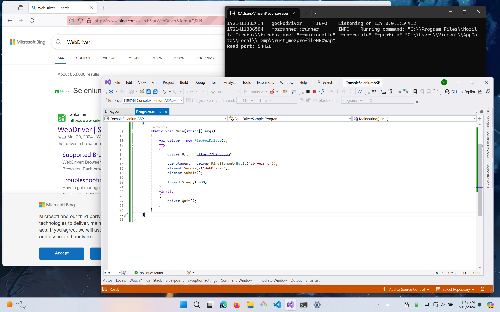

Setting up Selenium WebDrivers and the installation

1. To download and setup selenium WebDrivers... Check out the following link [Use WebDriver to automate Microsoft Edge](https://learn.microsoft.com/en-us/microsoft-edge/webdriver-chromium/?tabs=c-sharp)
2. Here is some code for Selenium WebDriver...

```csharp
using OpenQA.Selenium;
using OpenQA.Selenium.Edge;
using System.Threading;

namespace EdgeDriverSample
{
    class Program
    {
        static void Main(string[] args)
        {
            var driver = new EdgeDriver();
            try
            {
                driver.Url = "https://bing.com";

                var element = driver.FindElement(By.Id("sb_form_q"));
                element.SendKeys("WebDriver");
                element.Submit();

                Thread.Sleep(5000);
            }
            finally
            {
                driver.Quit();
            }
        }
    }
}
```

3. As I don't have Edge WebDriver installed at home, here is a Firefox version of it. It basically fills out the search button in the bing browser.
   
